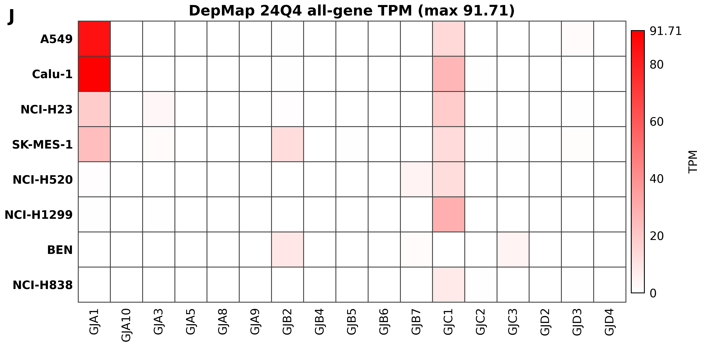

# DepMap 24Q4 TPM Extended Fig. 7C

**Author:** Mert Demirdizen ([mert@bmb.sdu.dk](mailto:mert@bmb.sdu.dk))

Publication-ready figure package for the paper's Extended Fig. 7C connexin mRNA heatmap using the official DepMap 24Q4 Public Figshare+ all-gene TPM source.

## Primary Outputs

- [Final figure PNG](figures/extended_fig7c_depmap_24q4_tpm.png)
- [Final figure PDF](figures/extended_fig7c_depmap_24q4_tpm.pdf)
- [Final figure SVG](figures/extended_fig7c_depmap_24q4_tpm.svg)
- [Figure without title PNG](figures/extended_fig7c_depmap_24q4_tpm_no_title.png)
- [Figure without title PDF](figures/extended_fig7c_depmap_24q4_tpm_no_title.pdf)
- [Figure without title SVG](figures/extended_fig7c_depmap_24q4_tpm_no_title.svg)
- [DepMap TPM matrix](tables/depmap_24q4_tpm_matrix.tsv)
- [Run manifest](run_manifest.json)
- [Methods](methods/depmap_24q4_tpm_methods.md)
- [Caption](methods/extended_fig7c_depmap_24q4_tpm_caption.md)

## Source Data

- DepMap release: [DepMap 24Q4 Public Figshare+ article](https://plus.figshare.com/articles/dataset/DepMap_24Q4_Public/27993248)
- Expression file: [`OmicsExpressionAllGenesTPMLogp1Profile.csv`](https://ndownloader.figshare.com/files/51065360)
- Default profile map: [`OmicsDefaultModelProfiles.csv`](https://ndownloader.figshare.com/files/51065339)
- Source expression unit: `log2(TPM + 1)`
- Reported/plotted unit: TPM, computed as `TPM = 2 ** log2_tpm_plus_1 - 1`

## Checksums

- `OmicsExpressionAllGenesTPMLogp1Profile.csv`: `57aa034ec15c48109333aad9d09d31bf8080ce222c45f3b0465fe8e7e7b88d7a` (1016340354 bytes)
- `OmicsDefaultModelProfiles.csv`: `096a96c39d88374cb7c37058816e6cde29d6617b820b8a14d33ae9dd821c6dc5` (90080 bytes)

## Figures



The primary TPM-native color scale uses `vmin=0` and `vmax=91.71`, the observed maximum in the DepMap 24Q4 TPM matrix.

## Key Tables

- `tables/depmap_24q4_tpm_matrix.tsv`: final 8 x 17 TPM matrix.
- `tables/depmap_24q4_log2_tpm_plus1_matrix.tsv`: source log2(TPM + 1) values before inverse transform.
- `tables/gene_availability_provenance.tsv`: gene matching/provenance table.
- `tables/sample_profile_mapping.tsv`: cell-line/model/profile mapping table.

## QC Summary

- All 17 plotted genes are present.
- `GJD3` is present as `GJD3 (ENSG00000183153)`.
- All 8 plotted cell lines map to default RNA profiles.
- The final TPM matrix has no missing values.
- PNG/PDF/SVG outputs are non-empty and parseable.

## Rerun

Run from the project root:

```bash
python3 ext7c_depmap/publication/extended_fig7c_depmap_24q4_tpm_connexin_heatmap/scripts/generate_extended_fig7c_depmap_24q4_tpm_connexin_heatmap.py --force
```

Add `--keep-raw` to retain the DepMap source CSV files under `raw/`; by default raw downloads are validated from cache or temporary download and are not retained in the repository.

For verification, run in a temporary copy of the repository. `--force` overwrites generated figures, tables, and run records in the selected checkout.

## Software

Package versions and run parameters are recorded in `run_manifest.json`.
